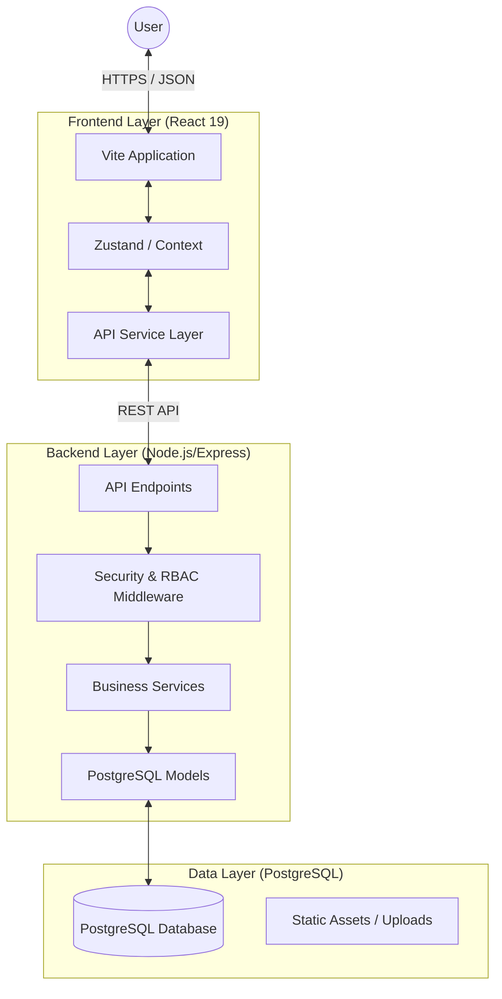

# 🏛️ Smart UPF: System Architecture

## 1. High-Level Overview
Smart UPF is an intelligence-driven university management platform built with a decoupled Full-Stack architecture. It focuses on **Scalability**, **Security**, and **Institutional Intelligence**.



---

## 2. Frontend Architecture (React 19)
The frontend is built using a **Feature-Based Modular Structure**, moving away from generic types to domain-specific folders.

### 🏗️ Design Patterns
- **Service Layer**: Components never call Axios directly. They use a dedicated service layer to handle data fetching, providing a clean abstraction.
- **Atomic Components**: Reusable UI components (Buttons, Modals, etc.) are separated from business logic.
- **Server State Management**: Uses **React Query** for caching, optimistic updates, and synchronization with the backend.
- **Client State**: Uses **Zustand** for lightweight global state (Auth, UI themes).

### 📂 Folder Structure
```text
frontend/src/
├── features/         # Modular domain logic (Auth, Students, Payroll)
│   ├── [feature]/
│   │   ├── components/  # Feature-specific UI
│   │   ├── hooks/       # Custom feature hooks
│   │   └── services/    # Data fetching for this feature
├── components/       # Global UI components
├── layouts/          # Layout wrappers (Dashboard, Sidebar)
├── api/              # Shared Axios client & Global interceptors
└── store/            # Global Zustand stores
```

---

## 3. Backend Architecture (Express.js)
The backend follows a **Modular MVC (Model-View-Controller)** pattern with a heavy emphasis on middleware-driven security.

### 🛠️ Core Components
- **Controllers**: Handle request/response logic and data orchestration.
- **Services**: Contain the core business logic (e.g., GPA calculations, Salary processing).
- **Models**: Direct SQL interface using `pg-pool` for high-performance PostgreSQL queries.
- **Middlewares**: Centralized logic for Logging, Error Handling, and Security.

### 📂 Folder Structure
```text
backend/src/
├── controllers/  # Request handlers
├── services/     # Core Business logic
├── models/       # Database access layer
├── routes/       # API endpoints (Restful)
├── middlewares/  # RBAC, JWT Auth, Validations
└── utils/        # Shared helpers (Logger, Errors)
```

---

## 4. Security & RBAC Architecture
Smart UPF uses a **Dynamic Role-Based Access Control (RBAC)** system.

### 🔐 Authentication Flow
1. **JWT Auth**: Uses short-lived Access Tokens (Memory) and long-lived Refresh Tokens (HttpOnly Cookies).
2. **Access Layers**:
    - **Tier 1**: Token verification (Is the user logged in?).
    - **Tier 2**: Role verification (Does the user have the role?).
    - **Tier 3**: Permission verification (Does this role have 'CREATE_STUDENT' permission?).

### 📊 Dynamic RBAC Table Logic
Permissions are stored in the database, allowing Super Admins to toggle capabilities for any role without changing code. Navigation sidebars are dynamically generated for each user based on these permissions.

---

## 5. AI-Driven Intelligence
Smart UPF integrates **Google Gemini AI** to provide an intelligent layer over institutional data.

### 🤖 Smart UPF Assistant (RAG Engine)
The assistant uses **Retrieval-Augmented Generation (RAG)** to provide context-aware support.
- **Context Injection**: Before sending a prompt to Gemini, the system fetches real-time data (Schedules, Grades, Finance) based on the specific `user_id` and `role`.
- **Function Calling**: The AI can "perform actions" by returning structured tags (e.g., `[ACTION:CREATE_TASK]`) which the backend intercepts to update the database (e.g., creating a personal study task).
- **Role-Spefific Personalization**:
    - **Students**: Academic progress and document eligibility.
    - **Professors**: Course scheduling and material management.
    - **Admins**: Departmental metrics and pending approvals.

### 🎓 AI Study (Interactive Learning)
Uses AI to transform static course materials into interactive tools.
- **Automated Quiz Generation**: Extracts text from PDF resources and generates 5-question multiple-choice quizzes (MCQs) mapped to the course content.
- **Performance Analytics**: Tracks student scores and history to provide insight into learning progress.

---

## 6. Database Schema (PostgreSQL)
The database is highly normalized (3NF) to ensure data integrity.

- **Primary Entities**: `users`, `employees`, `students`, `departments`, `roles`.
- **Academic Entities**: `classes`, `specialities`, `modules`, `grades`, `attendance`.
- **Administrative Entities**: `payroll`, `finance`, `notifications`, `messages`.
- **Key Constraints**: Using UUIDs for security, cascading deletes for relational integrity, and indexing on email/registration-num for performance.

---

## 7. Real-time Intelligence
- **AI Assistancy**: A constant companion for all users that provides instant answers and performs administrative tasks via natural language.
- **Dashboard Hub**: Aggregates data from multiple tables to provide real-time metrics (Total Enrollment, Staff Statistics, Revenue Analysis).
- **Notification Engine**: A background-ready system that triggers UI alerts for grades, messages, or attendance warnings.

---

*Last Updated: March 2026*
